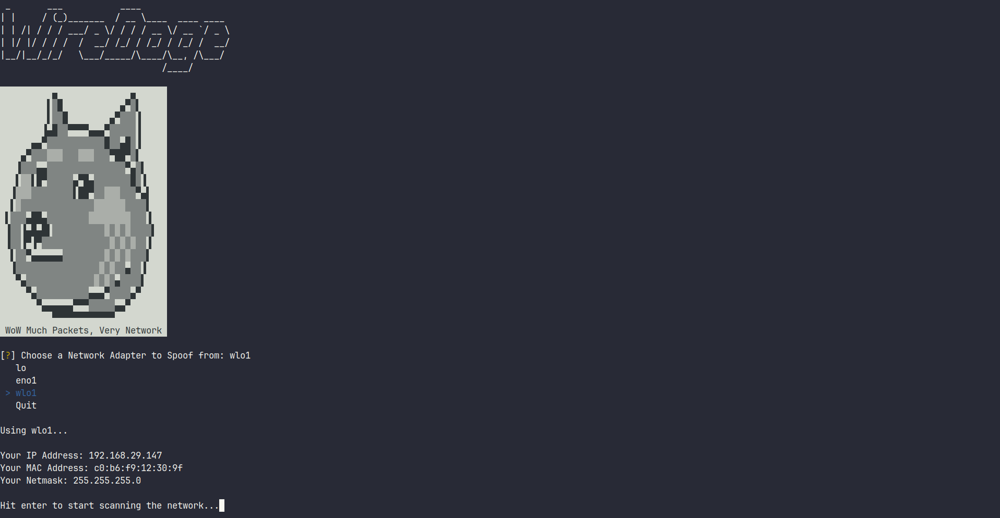
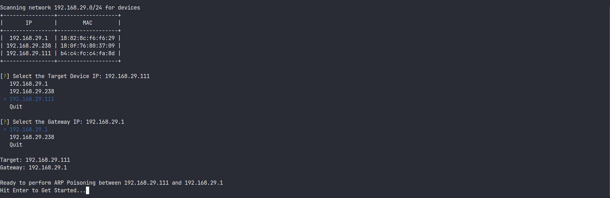
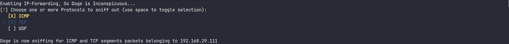
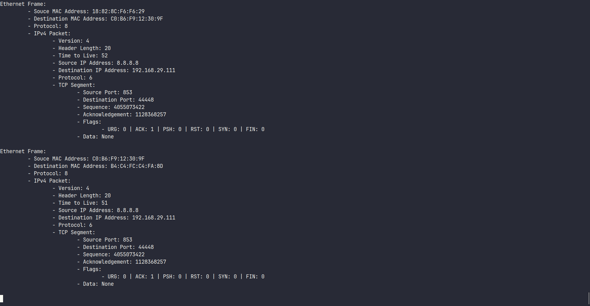
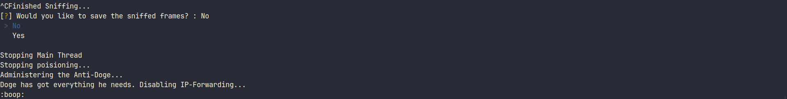

# WireDoge
<div align="center">

</div>


*Like WireShark, but Doge.*


WireDoge is a simple Man in the Middle Attack tool written in Python. 
It provides a friendly CLI menu interface that lets the attacker detect all the devices on their network, choose two hosts (one of which is generally the Gateway) and perform an ARP Cache poisoning attack to insert itself between the two targets.



Once the attacker's machine is between the two targets, they can choose what kind of packets to sniff from that link. Currently supported packet types are:

1. ICMP
2. TCP
3. UDP




The contents of the packets are well formatted in the output for easy understanding.



On completion of the attack, WireDoge cleans up after itself (name another dog that can do that, I'll wait), resets the ARP caches of the two target machines, leaving them none the wiser.



### Running WireDoge

Clone the repo and install the dependencies to get started. You need to run the script as `sudo` to get the permissions to access the required network interfaces:

```
git clone https://github.com/dkapur17/WireDoge
cd WireDoge
pip install -r requirements.txt
sudo env "PATH=$PATH" python main.py
```